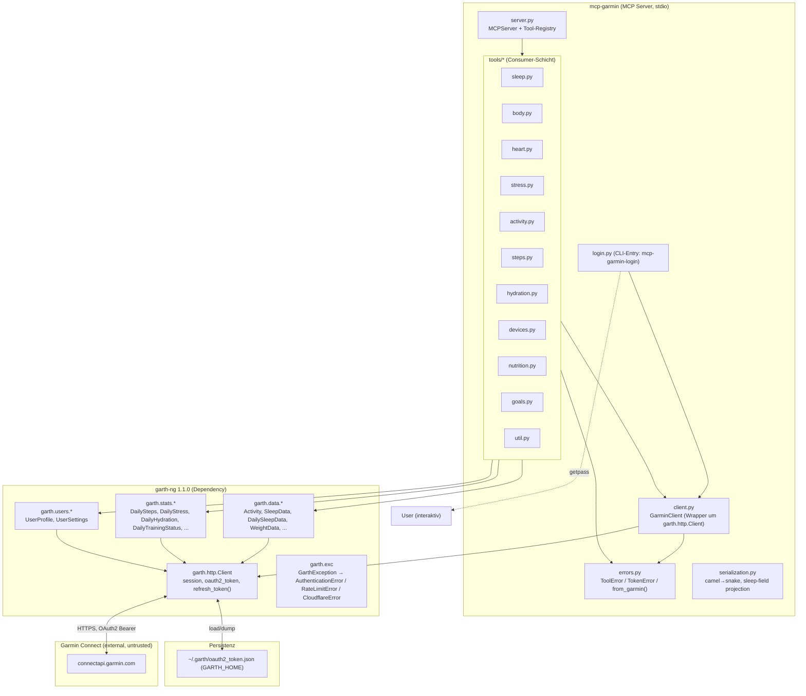
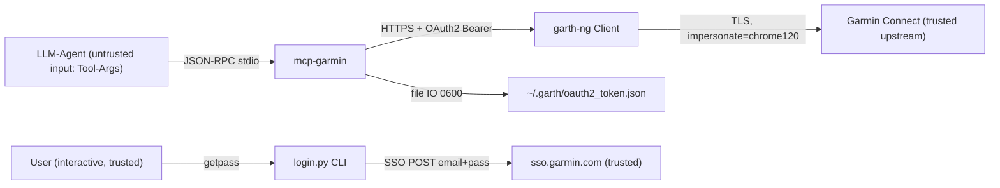

# Konzept: mcp-garmin auf garth-ng 1.1.0 migrieren

- **Feature-Card:** t_74b23096
- **Author:** sw-architect
- **Status:** Concept Review (Human)
- **Version:** v1 (2026-09-10)
- **Basis-Repo:** `/home/ss/src/mcp-garmin`, Branch `feature/garth-ng-compat` (Stand d15e677)
- **Spike-Cards:** S1 = t_7756ff1b (API-Mapping, läuft), S2 = t_d1a88188 (Tool-Fläche/Strategie, wartet auf S1)

---

## 1. Context & Goal

**Problem.** Der mcp-garmin MCP-Server (39 registrierte Tools) läuft auf `garth>=0.1.0` (legacy), das nicht mehr gepflegt wird. Neue Garmin-Connect-Änderungen (SSO-Flow, Cloudflare, Rate-Limits) brechen den Server bei Token-/Auth-Wechseln: `garth 0.x` nutzt OAuth1+OAuth2, während Garmin heute SSO + OAuth2-only liefert. Der aktuelle Code in `tools/*` referenziert zudem ~20 Legacy-Klassen (`Activities`, `ActivityDetail`, `ActivityMap`, `FitnessActivities`, `PersonalRecords`, `PersonalRecordTypes`, `NutritionLog`, `NutritionStatus`, `HydrationData`, `BloodPressure`, `ConnectedDevices`, `DeviceInfo`, `StepsGoal`, `WeightGoal`, `GarminScores`, `HeartRateData`, `HrvData`, `RestingHeartRateData`, `DailyStressData`, `WeeklyStressData`, `TrainingStatusDaily/Weekly/Monthly`, `TrainingReadiness`, `MorningReadiness`, `StepsData`, `WeeklyStepsData`), die in `garth-ng 1.1.0` nicht mehr existieren — diese Tools werfen `ImportError` zur Laufzeit und sind faktisch tot.

**Business-Goal.** Volle Funktion auf `garth-ng==1.1.0` (aktiver, gepflegter Fork: SSO-Login, `Client.refresh_token()` ohne SSO-Neulauf, `GARTH_HOME`-Token-Persistenz, Dataclass-API, `curl-cffi`-Browser-Emulation gegen Cloudflare) — mit maximalem Feature-Erhalt: Tool-Fläche bleibt so weit wie möglich stabil, jede Abweichung (Drop/Remap/Field-Change) ist in diesem Konzept dokumentiert. Damit bleibt der Server als Sleep/Activity/Wellness-Datenquelle im Hermes-Stack langfristig wartbar.

**Was sich ändert:**
- Pyproject: `garth>=0.1.0` → `garth-ng>=1.1.0,<2.0`.
- `client.py`: `GarminClient` wird Thin-Wrapper um `garth.http.Client` mit `GARTH_HOME`-Persistenz, `refresh_token()`-Pfad und `GarthException`-Mapping.
- `tools/*`: alle ~20 Legacy-Klassen-Importe werden auf garth-ng-Accessors (`garth.data.*`, `garth.stats.*`, `garth.users.*`) bzw. rohe `client.connectapi()`-Endpoints umgestellt (Mapping fixiert durch Spike S1).
- `login.py`: SSO-Login via `client.login(email, password, prompt_mfa=...)`, MFA-prompt-fähig.
- `repositories.py`/`garmin_service.py`: Schichten-Redundanz auflösen (heute existieren Service+Repository UND Tools parallel — Tools bypassen beide). Konzept-Entscheidung: **`garmin_service.py` + `repositories.py` werden als Legacy-Markup entfernt**; die Tool-Funktionen in `tools/*` werden die einzigen Consumer des `GarminClient` (siehe Component Cut). Begründung: Beide Schichten sind heute von keinem Tool aufgerufen (nur von `tests/test_service_repo.py`), ihr Erhalt würde Doppelwartung über die Migration hinaus bedeuten; der Repository-Pattern-Abstraktionspunkt wird der `GarminClient` selbst (ein Client pro Prozess, injizierbar).
- `errors.py`: `GarthException`-Hierarchie (u.a. `AuthenticationError`, `RateLimitError`, `CloudflareError`) in `ToolError`/`TokenError` mappen.

**Was sich NICHT ändert (Nicht-Ziele):**
- Keine neuen Features jenseits der bestehenden 39er Tool-Fläche (kein Fitness/Workout-CRUD, kein Upload, kein Hydration-Log-Write).
- Keine Frontend-Änderungen (existiert nicht).
- Kein DB-/Persistenz-Design jenseits `~/.garth/oauth2_token.json` (`GARTH_HOME`).
- Kein Breaking-Change an der Hermes-MCP-Registrierung, außer durch dokumentierte Drops (Sektion 3.3).
- Tool-Namen, die sich ändern, behalten wo immer möglich ihren Namen (siehe Sektion 3.3 Drop-/Remap-Liste).

**Zielzustand (Definition of Done auf Konzept-Ebene):** Server startet mit `garth-ng 1.1.0` aus frischem `.venv`, alle 39 Tools (abzüglich dokumentierter Drops) liefern bei gültigem Token echte Daten, Token-Refresh läuft ohne SSO über `refresh_token()`, Test-Suite grün mit Mock-Client, Coverage > 80 % auf der Tool-Schicht.

---

## 2. Component Cut



**Module & Boundaries:**

| Modul | Status nach Migration |
|---|---|
| `src/mcp_garmin/server.py` | Unverändert (Registry + `mcp.tool()`-Loop). Tool-Registry bleibt `tools/base.py` (`@register`). |
| `src/mcp_garmin/client.py` | **Kern der Migration.** `GarminClient` kapselt `garth.http.Client`: Singleton mit Injektions-Punkt, `GARTH_HOME`-Setup, `get_client()`, `refresh_token()`-Trigger, `_to_dict()` (via `garth.utils.asdict`), `_handle_garmin_error`-Decorator. |
| `src/mcp_garmin/errors.py` | **Kern der Migration.** `ToolError`, `TokenError(ToolError)`, `from_garmin(exc)` mit Mapping auf `garth.exc.AuthenticationError`/`RateLimitError`/`CloudflareError`. |
| `src/mcp_garmin/login.py` | CLI-Login: `GARTH_HOME` setzen, `client.login(email, password, prompt_mfa=...)` (MFA einbar), `UserProfile.get()` als Verifikation. Email aus `GARMIN_EMAIL`-Env, Passwort via `getpass`. |
| `src/mcp_garmin/tools/*.py` (11 Module) | **Kern der Migration.** Jede Legacy-Klasse → garth-ng-Accessor gemäß S1-Mapping. Tool-Signaturen bleiben stabil, wo S1 "1:1" meldet; bei "partiell" bleibt der Name, das Payload folgt S1. |
| `src/mcp_garmin/serialization.py` | bleibt (camel→snake + `project_sleep_fields`), dient `tools/*` und Tests. |
| `src/mcp_garmin/garmin_service.py`, `repositories.py` | **Entfernt** (Legacy-Markup, ungenutzt von `tools/*`, nur selbstgetestet). Entsprechende Tests (`test_service_repo.py`) entfernt. |
| `tests/*` | Tool-Tests auf Mocked `GarminClient`/`garth.http.Client` umstellen; contract-Test `tests/contract/test_tool_surface.py` ist der Anker für die 39er Tool-Fläche (Sektion 3.3). |
| `pyproject.toml` | `garth-ng>=1.1.0,<2.0`; `requires-python` → `>=3.10` (garth-ng-Requirement); `mcp` als Dependency explizit aufnehmen (heute implizit via `mcp.server`-Import in `server.py` — **Bug auf main, wird mitfixt**). |
| `__init__.py`, `__main__.py`, `util.py` | unverändert / trivial. |

**Neue Module:** keine. **Entfernt:** `garmin_service.py`, `repositories.py`.

---

## 3. Contracts

### 3.1 `GarminClient` (client.py)

```python
class GarminClient:
    """Single Garmin-Session pro Prozess. Injizierbar für Tests."""

    def __init__(self, garth_client: garth.http.Client | None = None) -> None: ...

    def get_client(self) -> garth.http.Client:
        """Garantiert gültige Session: lädt GARTH_HOME-Resume,
        versucht refresh_token() bei abgelaufenem OAuth2-Token
        (garth request() macht dies intern bei api=True automatisch).
        Raise TokenError, wenn kein Token existiert (-> login.py laufen lassen)."""

    def refresh(self) -> None:
        """Expliziter Refresh via client.refresh_token() (keine SSO).
        Persistiert automatisch nach GARTH_HOME (garth-intern)."""

    def _to_dict(self, obj: Any) -> dict:
        """garth-ng-Dataclass/Response -> dict (asdict; dicts passthrough; None -> {})."""

    def _handle_garmin_error(self, func: Callable) -> Callable:
        """Decorator: fängt garth.exc.GarthException -> ToolError/TokenError
        (via errors.from_garmin). Token-Fehler erkennen über
        AuthenticationError/refresh_expired, nicht nur Substring 'token'."""
```

Wichtig: `tools/*` bleibt bei `GarminClient()` (Singleton) + `from .base import register` — das Decorator-Muster (`@register` über `@_handle_garmin_error`) bleibt, damit `server.py` unverändert bleibt.

### 3.2 Tool-Contracts (Stichprobe; vollständige Tabelle nach S1)

Form jedes Tools (unchanged):

```python
@register
@_handle_garmin_error
def get_<name>(...parameter...) -> dict | list[dict]:
    """Docstring = MCP-Tool-Description (bleibt stabil)."""
    from garth.data import <NewAccessor>          # oder garth.stats / garth.users
    client = get_client()
    result = <NewAccessor>.get(..., client=client)   # bzw. .list(...) / connectapi(...)
    return _to_dict(result) / [_to_dict(e) for e in result]
```

Mapping-Prinzipien (Details werden von S1 als Tabelle `spike-api-mapping.md` fixiert):
1. **Accessor-First:** wo `garth.data.*`/`garth.stats.*`/`garth.users.*` den Endpunkt abdeckt → Accessor nutzen (Dataclass → `asdict()`).
2. **Endpoint-Fallback:** wo kein Accessor existiert (Kandidaten: `PersonalRecords`, `PersonalRecordTypes`, `NutritionLog`, `NutritionStatus`, `BloodPressure`, `ConnectedDevices`, `DeviceInfo`, `StepsGoal`, `WeightGoal`) → `client.connectapi("/connectapi/<path>")` + `camel_to_snake_dict()` im Tool. Exakte Pfade liefert S1 live.
3. **Drop:** wo beides live leer/fehlend ist → Tool bleibt registriert, liefert `[]`/`{}` + log-Warnung, **oder** wird entfernt (Entscheidung S2 priorisiert nach Nutzwert; Standard-Vorschlag: entfernen, da ein leeres Tool den LLM-Client verwirrt).
4. **Payload-Form:** snake_case, ISO-8601-Timestamps, Gewicht in Gramm — unverändert gegenüber main (contract-Test).

### 3.3 Tool-Fläche (39 Tools) — Drops & Remaps

Bekannte Drops/Kandidaten (final nur nach S1+S2; hier die Vorphauswertung aus Code-Analyse):

| Tool (Name bleibt, außer "→") | Status | garth-ng-Pfad |
|---|---|---|
| `get_sleep`, `get_sleep_detail`, `get_sleep_summary` | **bereits migriert** (compat-Branch) | `SleepData` / `DailySleepData` |
| `get_body_weight`, `get_weight_history` | 1:1 | `WeightData.get/.list` |
| `get_blood_pressure` | **drop-Kandidat** (kein Accessor; Endpoint live prüfen via S1) | `/usersummary-service/usersummary/bloodpressure` |
| `get_body_battery`, `get_body_battery_stress`, `get_body_battery_stress_history` | 1:1 | `BodyBatteryData.get`, `DailyBodyBatteryStress.get/.list` |
| `get_daily_heart_rate` | 1:1 (Remap von `HeartRateData`) | `DailyHeartRate.get` (returns `list[DailyHeartRate]`-Readings) |
| `get_hrv` | 1:1 (Remap von `HrvData`) | `HRVData.get` |
| `get_resting_heart_rate` | partiell (keine eigene Klasse mehr) | `DailyHeartRate.get` → `resting_heart_rate`-Feld / `DailySummary` |
| `get_daily_stress` | Remap | `stats.DailyStress.list` (bzw. `DailyBodyBatteryStress`-Readings) |
| `get_weekly_stress` | Remap | `stats.WeeklyStress.list` |
| `get_training_status_daily/weekly/monthly` | Remap | `stats.DailyTrainingStatus/WeeklyTrainingStatus/MonthlyTrainingStatus` |
| `get_training_readiness` | Remap | `TrainingReadinessData.get` |
| `get_morning_readiness` | Remap | `MorningTrainingReadinessData.get` |
| `get_activities` | Remap (`Activities.list(end,days)` → `Activity.list(limit,start)`) | **Signature-Change**: `(end, days)` → `(limit=20, start=0)` — dokumentiert, da legacy-Signatur nie funktionierte (Klasse existiert in ng nicht) |
| `get_activity_detail`, `get_activity_map` | 1:1 (`Activity.get`; Map: `Activity.map_details` falls in 1.1.0 vorhanden, sonst raw `/activity-service/activity/{id}/map`) |
| `get_fitness_activities` | Remap | `FitnessActivity.list(end, days)` |
| `get_personal_records`, `get_personal_record_types` | **drop-Kandidaten** (kein Accessor; Endpoints: `/personalservice-service/prs`, `/personalservice-service/prs/types` — S1 live-Verifikation) |
| `get_daily_steps`, `get_weekly_steps` | Remap | `stats.DailySteps.list`, `stats.WeeklySteps.list` |
| `get_daily_summary`, `get_daily_summary_history` | 1:1 | `DailySummary.get/.list` |
| `get_daily_hydration`, `get_hydration_history` | Remap | `stats.DailyHydration.list` |
| `get_connected_devices`, `get_device_info` | **drop-Kandidaten** (kein Accessor; raw `/proxy/deviceinfo-service/device[s]` wie heute, S1 verifiziert; `device_info` heute schon `device_id`-parametrisiert, ng hat keinen ID-Parameter → ggf. Signature auf `get_device_info()` ohne Param) |
| `get_nutrition_log`, `get_nutrition_status` | **drop-Kandidaten** (kein Accessor; Endpoints `/connectapi/proxy/nutrition-log-service/log/nutrition/{date}`, `/nutrition-status-service/status` — S1 live) |
| `get_steps_goal`, `get_weight_goal` | **drop-Kandidaten** (kein Accessor; `DailySteps.step_goal`-Feld ersetzt steps_goal; weight goal via `/usersummary-service/usersummary/weight/goal` — S1) |
| `get_garmin_scores` | 1:1 (`GarminScores.get` → `GarminScoresData.get`) |
| `get_user_profile`, `get_user_settings` | 1:1 | `users.UserProfile.get`, `users.UserSettings.get` |

**Regel:** Tool-Namen ändern sich nur, wenn der Name die alte (in ng tote) Implikation trägt und S2 das bestätigt; ansonsten Name stabil, Payload nach S1.

### 3.4 Login-CLI (`mcp-garmin-login`)

```
$ GARTH_HOME=~/.garth mcp-garmin-login
Garmin email: [GARMIN_EMAIL-Env, prompt if unset]
Garmin password: (getpass, nie geloggt)
[optional: MFA code prompt wenn Garmin MFA verlangt]
Verified: profile '<userName>' accessible
```

Exit 0 = Token in `~/.garth/oauth2_token.json` + Verifizierung ok; Exit 1 sonst.

---

## 4. Data & Persistence

- **Token:** `~/.garth/oauth2_token.json` (JSON, `OAuth2Token`-Dataclass via `asdict`), geschrieben von `garth` bei `login()`/`refresh_token()` (automatisch, wenn `GARTH_HOME` gesetzt). `oauth1_token.json` wird von ng nicht mehr genutzt (nur Abwärts-Kompatibilität bei `load()`).
- **Lese-Pfad:** `Client._auto_resume()` bei Konstruktion → `client.load(GARTH_HOME)`. `request(api=True)` prüft `oauth2_token.expired` → ruft `refresh_token()` auf, wenn `not refresh_expired` (kein SSO, kein 429-SSO-Tanz).
- **Keine eigene Persistenz-Schicht:** kein DB-Design, kein Caching über Process-Lifetime hinaus. `GarminClient` hält den Singleton-Client; `GARTH_HOME` ist der einzige stateful Punkt.
- **Repository-Abstraktion:** bleibt `GarminClient` als einzige Datenquelle-Abstraktion (Repository-Pattern auf API-Ebene, nicht auf DB-Ebene). Tools dürfen keinen `garth`-Import außer über `GarminClient.get_client()` und die Accessor-Modul-Imports (`garth.data/stats/users`) — die Accessor-Classmethods sind Teil der API-Kontrakt von garth-ng, kein eigener State.
- **Units/Shape:** Gewicht in **Gramm** (Garmin-Native, `weight`-Feld), Steps int, Timestamps ISO-8601 lokal + GMT wo beide vorhanden, snake_case via `camel_to_snake_dict`. Contract-Test `tests/contract/test_tool_surface.py` pinned diese Form.

---

## 5. Cross-cutting

- **DI:** `GarminClient(garth_client=...)` für Test-Injektion; `tools/*` bleiben Singleton-basiert (Process-Local, identisch zu heute) — DI-Punkt ist der `GarminClient`-Konstruktor, nicht die Tool-Ebene (KISS: 39 Tools × Injektion wäre Rauschen).
- **Error-Handling:** ein Eintrag (Sektion 3.1): `GarthException` → `errors.from_garmin()`:
  - `AuthenticationError` / "OAuth2 token" / `refresh_expired` → `TokenError("... run mcp-garmin-login")`
  - `RateLimitError` (429/`Too Many Requests`) → `ToolError("rate-limited; retry later")`
  - `CloudflareError` (403/challenge) → `ToolError("Cloudflare challenge; check network/UA")`
  - sonst → `ToolError("Garmin API error: ...")`
  Kein Bare-`except` in `tools/*`; `garmin_service.py` (mit seinen `except Exception: return {}`) wird entfernt.
- **Logging:** `logging.getLogger("mcp_garmin")`; **keine PII** (kein Email, kein Profil-Name, kein `activity_name`); nur Endpoint-Pfad, Status, Token-Status. `GARTH_TELEMETRY_ENABLED=false` ist Default (garth-ng-Telemetrie deaktivieren — Sektion 6).
- **Config/Env:**
  - `GARTH_HOME` (Default `~/.garth`) — gesetzt von `login.py` und `client.py` (setdefault).
  - `GARMIN_EMAIL` (optional; Default wie heute im Code, aber künftig nur via Env, Hardcode entfernen).
  - `GARTH_TELEMETRY_ENABLED=false` (Default setzen).
  - `GARMIN_DOMAIN` (Default `garmin.com`; für `garmin.de`-Accounts relevant).
  - `.env.template` um diese Variablen aktualisieren; `GARTH_TOKEN_DIR` wird deprecated (Alias für `GARTH_HOME`, ein Release lang).
- **Threading:** `Data.list()` nutzt `ThreadPoolExecutor(max_workers=10)` intern in garth-ng (heute auch) — kein eigenes Threading in Tools.

---

## 6. Security Consideration (Threat-Model-Light)

**Trust Boundaries:**



- **Untrusted Input:** (a) Tool-Argumente vom LLM (Dates als `str` — `YYYY-MM-DD` validieren, `int` clampen: `limit/start/days/period ≥ 0`, `days ≤ 365`), (b) Garmin-Response (Dataclasses mit Defaults schützen; `asdict` nur über bekannte Dataclasses), (c) Token-Datei (lokal, `chmod 600` bei `login()`/`refresh()` nach dump — garth-ng setzt das nicht selbst, **muss mcp-garmin sicherstellen**).
- **AuthN/AuthZ:** Single-User, lokale stdio-Registrierung in Hermes (kein Netzwerk-Port, kein Remote-MCP). AuthZ = FS-Rechte auf `~/.garth`. Kein zusätzlicher Auth-Mechanismus nötig.
- **Secrets:**
  - `oauth2_token.json` (long-lived refresh token + access token) → `0600`, Verzeichnis `0700`, nie in Logs/Exceptions (garth-ng loggt Token-Content nicht; wir loggen nur Status).
  - Garmin-Passwort: nur bei interaktivem `getpass` in RAM, nie Env-persistiert (`.env`-Eintrag `GARMIN_PASSWORD` wird **entfernt** aus Template/README — heute ein Hygiene-Problem).
  - `GARMIN_EMAIL`: PII-light, Env-ok.
- **Dependency-Risiko:**
  - `garth-ng` (cyberfossa): aktiv gepflegt, MIT, `curl-cffi` (Browser-Fingerprinting), `pydantic`, `pydantic-settings`, `logfire` (Telemetrie — bei `GARTH_TELEMETRY_ENABLED=false` kein Senden; bei `send_to_logfire=true` ginge Data an Logfire → Default `false`), `garmin-fit-sdk` (FIT-Parsing). `pip-audit` im Dev-Gate.
  - `curl-cffi`-Impersonation `chrome120`: Cloudflare-Countermeasure; Fingerprint-Change bei `curl-cffi`-Upgrade → `pip-audit` + Watch auf garth-ng-Releases.
- **Injection:** keine DB/Command/Template-Injection. Path-Traversal: `GARTH_HOME`-Pfad wird expandiert, aber nur `join` mit `oauth2_token.json` (garth-intern) — kein User-Input im Pfad.
- **PII in Logs:** nur Endpoint + Status + Error-Klasse. Kein `userName`, kein Email, keine `activity_name`, keine GPS-Koordinaten (Map-Data ist Payload, kein Log).
- **Für Security-Review (Phase 5):** Token-Datei-Permissions, Telemetrie-Default, Passwort-Handling bei MFA-Prompt, `curl-cffi`-CABundle (System vs. gebundelt — `ssl_verify`-Konfigurierbarkeit prüfen).

---

## 7. Testability

- **Unit (Mocked `garth.http.Client`):**
  - Jedes Tool: ein Test pro Verhalten (happy path, leer (`None`/`[]`), Error-Path via `GarthException` → `TokenError`).
  - `GarminClient`: `get_client()` mit/ohne `GARTH_HOME`-Token, `refresh()`-Aufruf bei expired Token, `from_garmin`-Mapping pro `GarthException`-Subklasse.
  - `login.py`: SSO-Flow mit Mocked `client.login` (inkl. MFA-Prompt-Pfad).
  - Contract-Test `test_tool_surface.py`: exakte 39er Tool-Liste + Signatur-Pinning (nach S2-Final-Liste aktualisiert).
  - `serialization`: camel→snake, `project_sleep_fields` (unverändert).
- **Integration (echter Client, echter Token — manuell/getagged `@pytest.mark.live`):**
  - `mcp-garmin-login` → Token-Datei existiert, `0600`.
  - `get_user_profile` liefert `profile_id`.
  - Je 1 Smoke pro Domain: sleep, steps, stress, activity list, weight.
  - `refresh_token()`-Pfad: Token künstlich expiren (Expire-Datum in der Datei zurückdatieren) → nächster Aufruf refresh, kein SSO.
- **Test-Daten:** Fixtures aus echten (anonymisierten) Garmin-Payloads in `tests/fixtures/` (aus S1-Live-Runs — S1 sammelt sie); keine Fake-Payloads.
- **Coverage:** > 80 % auf `tools/*` + `client.py` + `errors.py`.
- **Keine Test-Code-Änderung in `garmin_service`/`repositories`** — beide Schichten und deren Tests werden entfernt (ein Work-Paket, < 1h).

---

## 8. Risks & Unknowns

### Unknowns (Spike-Cards, müssen vor Work-Packages gelöst sein)

| ID | Unknown | Spike-Card | Owner |
|---|---|---|---|
| U1 | Exakte garth-ng-Accessor/Endpoint-Mapping pro Tool inkl. Live-Payload-Shape (Feldnamen, Units) für alle 39 Tools; welche der "drop-Kandidaten" (Sektion 3.3) live Daten liefern und welche tatsächlich drop sind. | **S1 = t_7756ff1b** (läuft) — liefert `docs/architecture/garth-ng-migration/spike-api-mapping.md` | sw-architect |
| U2 | Basis-Entscheidung (main vs. `feature/garth-ng-compat` — hier: compat-Branch, da 4-File-Diff zu main und sleep/login schon drin; S2 bestätigt), Drop-Priorisierung nach Nutzwert, Hermes-MCP-Registrierungs-Constraint (dürfen Tool-Namen/Anzahl sich ändern?), README/Docs-Sync. | **S2 = t_d1a88188** (wartet auf S1) — liefert `docs/architecture/garth-ng-migration/spike-scope.md` | sw-projectmanager |

### Risiken (mit Mitigations)

| Risiko | Likelihood | Impact | Mitigation |
|---|---|---|---|
| `Activity.map_details` / Activity-Map-Endpoint fehlt in ng 1.1.0 | mittel | mittel | S1 verifiziert; Fallback: raw `connectapi("/activity-service/activity/{id}/map")`; sonst dokumentierter Drop. |
| `DailyTrainingStatus`-Parsing hängt an `mostRecentTrainingStatus`-Shape (ng intern) | mittel | mittel | S1 live-Check; bei Shape-Drift: ng-Bug-Report + raw-Endpoint-Fallback. |
| `curl-cffi`-Impersonation vs. Garmin-Rate-Limits/Cloudflare bei `Data.list()` mit 10 Parallel-Requests | mittel | mittel | `max_workers` in Tools für Liste-Tools auf 3–5 begrenzen (ng-Parameter); S1 misst Latenz/429. |
| Token-Datei wird bei `refresh_token()` von garth **ohne** `0600` überschrieben (neue Datei mit umask) | hoch | mittel | `login.py`/`client.py` setzen `os.chmod(dir, 0o700)` + `chmod(file, 0o600)` nach `dump()` (Hook in `GarminClient.refresh()`); Security-Review prüft. |
| `get_activities`-Signature-Change (`end,days` → `limit,start`) bricht existierende Hermes-Workflows | niedrig | mittel | S2 prüft Workflow-Usage; alternativ: `get_activities(limit=20, start=0)` + Deprecated-Wrapper `get_activities_by_date(end, days)` bis nächste MAJOR. |
| garth-ng-Telemetrie (`logfire`) sendet Data trotz `enabled=false` | niedrig | hoch (PII/Datenschutz) | Default `GARTH_TELEMETRY_ENABLED=false`; Security-Review bestätigt No-Send; ggf. `configure(telemetry_enabled=False)` explizit in `GarminClient`. |
| `GARMIN_PASSWORD` in `.env` existiert heute bereits (committed? untracked?) | niedrig | hoch | Sofort-Check in WP1: `.env` in `.gitignore` (ist), `git log -- .env` (History-Audit); aus Template/README entfernen. |
| Sleep-Payload-Drift: `DailySleepData` vs. altes `SleepSummaryData`-Shape (Details/Summary teilen sich jetzt einen Source) | hoch | niedrig | Bekannter, dokumentierter Remap (compat-Branch); contract-Test pinnt neues Shape. |
| ng `Activity.list` liefert weniger Felder als legacy `Activities.list` (Summary fehlt) | mittel | niedrig | S1 dokumentiert Delta; Tool-Description anpassen. |

### Open Questions für die Review

1. **Drop-Strategie:** leere Tools zurückhalten (`{}` + Warnung) oder entfernen? (Vorschlag: entfernen, S2 priorisiert; Standard bei 0-Daten-Tags = entfernen.)
2. **Basis:** `feature/garth-ng-compat` als Merge-Basis statt `main` — S2 bestätigt (Vorschlag: ja).
3. **`get_activities`-Signature:** Breaking-Change akzeptieren, oder Deprecated-Wrapper mitführen? (Vorschlag: direkt `limit/start`, da Legacy-Niemals-gefahren.)
4. **`mcp`-Dependency** in `pyproject.toml` explizit aufnehmen (heute implizit) — ja/nein? (Vorschlag: ja, Version `mcp>=1.0`).